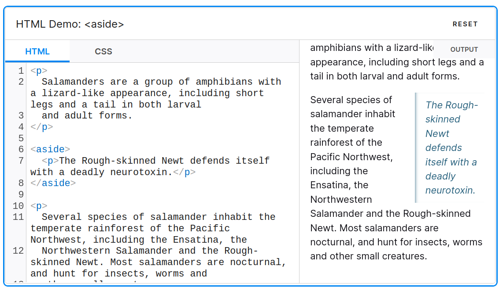

 

### The `<aside>` element

The `<aside>` element is typically used to display additional information that complements the main content.

<https://developer.mozilla.org/en-US/docs/Web/HTML/Element/aside>

### How is the `<aside>` element handled in the accessibility tree?

Each HTML element has a specific role in the accessibility tree, which helps users navigate content via assistive tools like VoiceOver. For example, the `<aside>` element assumes a complementary role in the accessibility tree.

However, in certain exceptional cases, the `<aside>` element does not assume this complementary role. According to the HTML specification (<https://w3c.github.io/html-aam/#el-aside>), when it is nested within sectioning content elements like `<article>`, `<section>`, `<nav>`, or another `<aside>`, it should not be treated as complementary. For your information, sectioning content in HTML refers to elements that define the structure of a document and represent independent content blocks or structural units.

<https://html.spec.whatwg.org/multipage/dom.html#sectioning-content-2>

### Incorrect bug report in the Chromium project

Initially, there was confusion because of the different behavior in Firefox and Safari compared to Chromium. This led to a misconception that there was a bug in Chromium.

<https://bugs.chromium.org/p/chromium/issues/detail?id=1459657>

The bug reporter assumed the `<aside>` element should have a complementary role, as it does in other browsers. However, the report didn't account for the exceptional case where a generic role is correct.

Further discussion within the W3C community clarified that the behavior in Chromium was expected, and that the other browsers showed the wrong behavior.

<https://github.com/w3c/html-aam/issues/512>

This example illustrates how difficult it is to correctly implement web accessibility standards. Even the QA engineer was confused and confirmed this as a bug.

### Code refactoring in Chromium

<https://chromium-review.googlesource.com/c/chromium/src/+/5004497>

Consequently, I abandoned my initial patch and instead refocused on refactoring the `GetLandmarkIsNotAllowedAncestorRoles()` function in Chromium to improve clarity.

### Fixing the bug in WebKit

I then fixed the related bug in WebKit by allowing `<aside>` elements to be assigned a generic role when nested within `<aside>`, `<article>`, `<section>`, or `<nav>` elements, ensuring alignment with the specification. I hope that this fix will be included in the next release of the Safari browser.

<https://github.com/WebKit/WebKit/pull/20013>

### Firefox issue

Additionally, I am currently working on the same problem in the Firefox browser.

<https://phabricator.services.mozilla.com/D193495>

It's been quite a while since I last contributed to Firefox, so this task has been somewhat challenging. I had to learn everything from scratch, including downloading the source code, understanding the build process, and submitting my patch.

The Bugzilla UI had changed, so it took some time to get used to it. Nevertheless, I've managed to work through these steps and received the initial review from a reviewer.

<https://phabricator.services.mozilla.com/D193495>

<https://developer.mozilla.org/en-US/docs/Web/HTML/Element/aside>

### Efforts in web compatibility

Web compatibility is incredibly important, and a lot of effort is going into reducing the differences between browsers. I'm really happy to be able to contribute to this effort with my work.

