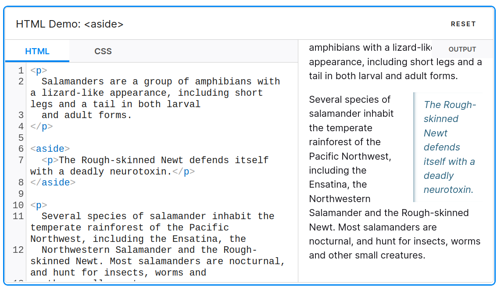

 

### The `<aside>` element
The `<aside>`element is typically used for displaying additional information that complements the main content.

https://developer.mozilla.org/en-US/docs/Web/HTML/Element/aside

### How is the `<aside>`element handled in the accessibility tree?
Each HTML element has a specific role in the accessibility tree, helping users in navigating content via assistive tools like VoiceOver.  For example, the `<aside>`element assumes a complementary role in the Accessibility Tree.

However, in certain exceptional cases, the `<aside>`element does not assume this complementary role. According to the HTML specification(https://w3c.github.io/html-aam/#el-aside), when nested within sectioning content elements like `<article>`, `<section>`, `<nav>`, or another `<aside>`, it should not be treated as complementary. For your information, sectioning content in HTML refers to elements that define the structure of a document and represent independent content blocks or structural units.

https://html.spec.whatwg.org/multipage/dom.html#sectioning-content-2

### Incorrect bug report in Chromium project
Initially, there was confusion due to different behaviors in Firefox and Safari compared to Chromium. This led to a misconception about a bug in Chromium.

https://bugs.chromium.org/p/chromium/issues/detail?id=1459657

However, further discussions within the W3C community clarified that the behavior in Chromium was expected, and other browsers showed the wrong behavior.

https://github.com/w3c/html-aam/issues/512

This example illustrates the difficulty of correctly implementing web accessibility standards.
Even the QA engineer was confused and confirmed this as a bug.

### Code refactoring in Chromium
https://chromium-review.googlesource.com/c/chromium/src/+/5004497

Consequently, I abandoned my initial patch and instead refocused on refactoring the GetLandmarkIsNotAllowedAncestorRoles() function in Chromium to enhance clarity.

### Fix the bug in WebKIt
I then fixed the related bug in WebKit by enabling `<aside>`elements to be assigned a generic role when nested within `<aside>`, `<article>`, `<section>`, or `<nav>` elements, ensuring alignment with the specification. Therefore, I hope that this fix will be included in the next release of Safari browser.

https://github.com/WebKit/WebKit/pull/20013

### Firefox issue
Additionally, I am currently working on the same problem in Firefox browser.
https://phabricator.services.mozilla.com/D193495

It's been quite a while since I last contributed to Firefox, so this task has been somewhat challenging. I had to learn everything from scratch, including downloading the source code, understanding the build process, and submitting my patch. 

The Bugzilla UI was changed, so it took some time to get used to the Bugzilla UI. Nevertheless, I‘ve managed through these steps and got the initial review from a reviewer.
https://phabricator.services.mozilla.com/D193495

https://developer.mozilla.org/en-US/docs/Web/HTML/Element/aside

### Efforts in Web Compatibility
Web compatibility is incredibly important, and there's a lot of effort going into reducing the differences between browsers. I'm really happy to be able to contribute to this effort with my work.

