Joone Hur, Web Technology Team, Open Source Technology Center

> This article was originally published on [01.org](https://01.org/blogs/joone/2018/using-chrome-os-graphics-stack-intel-based-linux-desktops).

## Overview

Chromebook graphics performance has improved due to the graphics acceleration
features provided by Intel® Atom® and Intel® Celeron® System on a Chip (SoC)
processors. These features, which include zero-copy texture upload, hardware
overlay/atomic page-flip, and video encoding/decoding, enable Intel Chromebooks to
achieve better performance, save system memory, and extend battery life.

The interesting thing is that many embedded devices have built their own
complicated user interface using web technology because the computing power is
enough to run a web engine. Many new web technologies such as HTML5 and device APIs
also allow developers to access hardware components and sensors on devices. However,
there are still limitations: web applications are not as responsive as native
applications. Using 4K video, WebGL, and CSS animations are limited due to the slow
performance.

This article describes the hardware acceleration features that are available on the
Intel Chromebooks. It also explains how to use the graphics stack on Intel-based
Linux systems to improve the performance of your web applications.

## New graphics architecture in Chrome OS (2015)

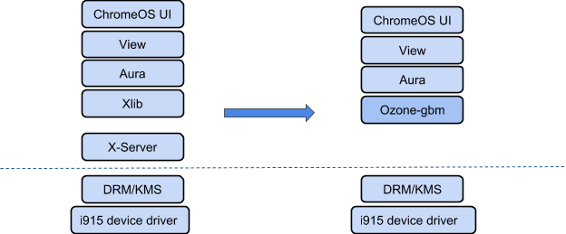

In 2015, Google released Freon, a new graphics stack that runs on Intel Chromebooks
and eliminates the X-Window dependency to provide better performance and lower power
consumption and memory usage. To achieve this, Google and Intel worked together to
use the hardware acceleration features available in Intel-based Chromebooks.

## Ozone

Google wanted to enable GPU accelerations and run Chromium on multiple platforms
such as Linux, Windows, MacOS, and embedded systems. As a result, the Ozone layer
was introduced into Chromium, which easily separates event handling and surface
acceleration. ozone-gbm is part of an effort that was originally designed for Chrome
OS to remove X11. It allows Chromium to run on embedded systems and new
X11-alternative window systems such as Wayland or Mir. Currently, there are three
backends of Ozone: X11, Wayland, and DRM, as shown in the following diagram.

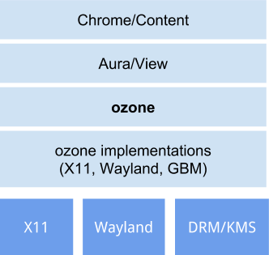

## Ozone-gbm

Ozone-gbm is one of the Ozone backends that allows Chrome OS to interact directly
with DRM/KMS and evdev to remove the X11 dependency. As shown in the following
diagram, mini-gbm is a library of user-level APIs used to allocate a buffer directly
to the GPU memory accessible by a rendering process. It is easier to enable Intel
graphics features such as texture zero-copy, hardware overlay, and video decoding
via ozone-gbm. Chrome OS also uses the mode-setting to change the display mode and
align events from evdev and painting with vsync signal generated by GPU.

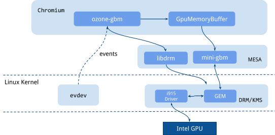

## History

The team that created [the ozone-wayland project](https://github.com/intel/ozone-wayland)
also worked on ozone-gbm for Linux desktop. [A blog article](https://software.intel.com/en-us/blogs/2014/10/23/chromium-ozone-gbm-explained)
was posted on Intel 01.org site to introduce this work. I took over this work to
continue to support ozone-gbm with hardware accelerations for Linux desktop. It was
not easy to get ozone-gbm to run on desktop Linux because the Chrome OS architecture
was significantly changed when [Servicification](https://www.chromium.org/servicification)
was introduced. I successfully ran the Chromium browser in M58 using mojo UI service
(MUS) with ozone-gbm on Yocto Linux. Refer to the details at
[ozone-dev mailing list](https://groups.google.com/a/chromium.org/forum/#!searchin/ozone-dev/ozone-gbm/ozone-dev/Cu1rOusi4BU/m98xPMxVBgAJ).

## Why ozone-gbm for Linux Systems?

Many Linux systems have adopted Web technologies, therefore the Chromium browser has
become a de facto standard for Linux based devices. However, because most devices
have low graphics performance in hardware, they are limited to rendering CSS
transforms/transition/animations, WebGL, and video playback. In addition, single web
applications don't need a windowing system, however, a windowing system (for example,
X-Window or Wayland) is required to launch the Chromium browser on Linux systems.

Ozone-gbm was introduced in Chrome OS, which has been highly optimized for
Intel-based Chromebooks, but can also be used on Intel-based Linux systems.
Therefore, we are able to improve the graphics performance of Web applications by
providing a way to run ozone-gbm using hardware acceleration features on Linux
systems.

## Why ozone-gbm on Intel GPU?

Intel and Google have supported modern graphics systems through ozone-gbm on
Chromebooks that provides a hardware compositor, atomic page flip, hardware overlay,
and video encode/decode for Intel GPUs (graphics processing units).

As a result, Chromium has enabled the following features such as zero-copy texture
uploads for 2D rendering, video acceleration for HTML5 video/WebRTC, and hardware
overlay for video/android apps/WebGL. Let's take a look at each feature in more
detail.

## Intel graphics features: zero-copy texture upload

Typically, we must perform one copy to upload a bitmap to GPU memory because the GPU
memory is separate from the main memory, which can hurt overall performance and use
more memory. However, in Intel architecture containing
[integrated Processor Graphics](https://software.intel.com/sites/default/files/managed/c5/9a/The-Compute-Architecture-of-Intel-Processor-Graphics-Gen9-v1d0.pdf),
we can share the same physical memory between CPU and GPU, allowing a renderer
process to paint content on an imported GPU buffer via VGEM that allows a
non-privileged user process to map a previously allocated graphics buffer. This
feature is called zero-copy texture upload and it provides significant performance
benefits and reduces memory footprint. It is only supported on Intel-based
Chromebooks.

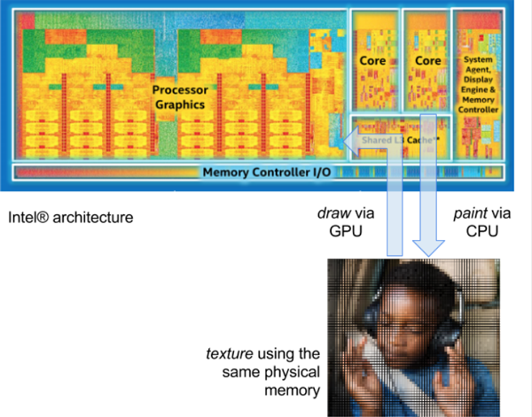

## Estimated performance results

Our team estimated performance test results for zero-copy texture upload, as shown
below:

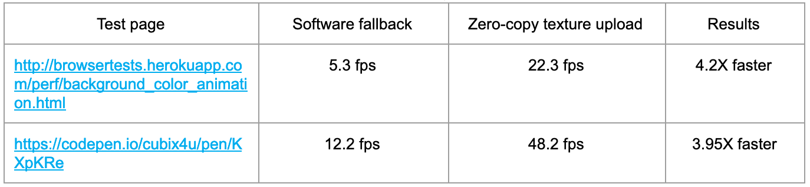

In some cases, zero-copy texture upload is almost 4 times faster than the software
fallback. Generally, it is 30~40% faster.
([test page1](http://browsertests.herokuapp.com/perf/background_color_animation.html),
[test page2](https://codepen.io/cubix4u/pen/KXpKRe))

## Estimated memory consumption

Our team estimated memory consumption for zero-copy texture upload, as shown below:

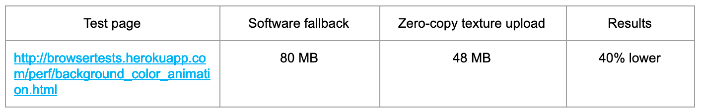

Zero-copy texture uploads are more effective in terms of memory consumption and
power savings. For Chrome OS, the memory usage of the GPU process is about 65% lower
than the software fallback in native zero-copy. The memory consumed by the renderer
process is about 20% lower in native zero-copy.

## Intel graphics features: video/image accelerations

The following table shows all the codecs supported by Intel SoCs for each
generation. As you can see, the latest Intel® Atom® and Intel® Core® processors,
listed below by their code names, support all hardware codecs that are enabled for
Intel-based Chromebooks.

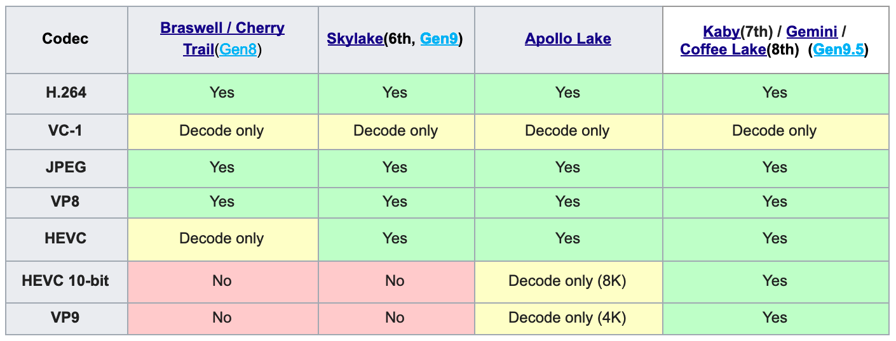

### Estimated performance test: video decoding, Intel Compute stick (Atom)

The Intel® Atom® processor is not as powerful as the Intel® Core® series, so it is
important to use the hardware codecs. As you can see in the following table, FPS of
hardware accelerated video is estimated at 1.7~3.6 times higher, so you can play
larger videos (2K, 4K).

Note: Results were estimated using an Intel Compute stick X5-Z8300 (codenamed Cherry
Trail, Gen8 graphics, GPU RAM 512MB).

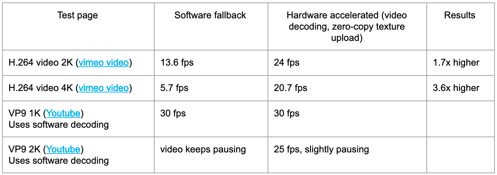

## Intel graphics features: hardware overlay

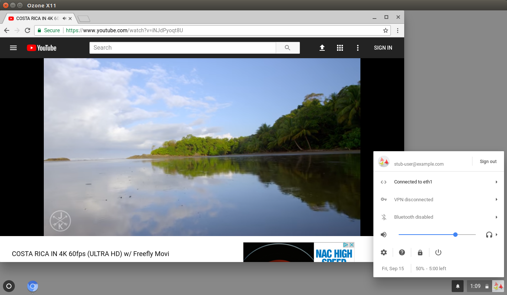

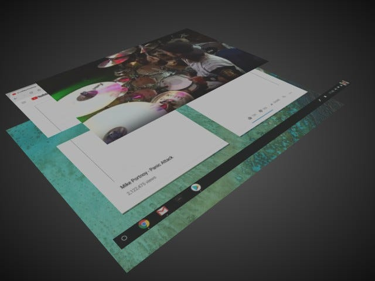

In many cases, the GPU composites all the layers in the webview for the Web
graphics. On an Intel-based Chromebook, this is not true, because the hardware
overlay has been supported since Sept. 2017. Let's take a look at the difference.

## Legacy: GPU Composition

The following diagram shows how the GPU composites the UI of Chrome OS. As you can
see, the GPU composites all the UI elements including web content and puts the final
buffer into the primary plane.

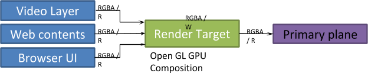

## Brand-new: Hardware Overlay

The following diagram shows how the [Hardware overlay](https://en.wikipedia.org/wiki/Hardware_overlay)
works. As you can see, the display compositor combines the overlay plane for a video
and the primary plane for the UI/Web contents into a single frame buffer that is
later scanned out for display. This method saves GPU bandwidth and battery power.

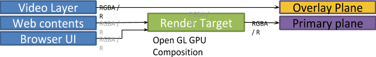

## Add support for hardware overlay and atomic pageflip in Chrome OS

Hardware overlay is not only for video, but also for rendering Android applications
that run on a hardware overlay plane, such as the Wayland client of Chrome OS. A
WebGL overlay will be also supported in Gen 10. To do this, the display controller
must support atomic updates to synchronize the plane updates. In M61 (released in
Sept. 2017), atomic pageflip was enabled on Intel SoCs codenamed Kaby Lake and
Apollo Lake.

## Benefits of Ozone-gbm

Ozone-gbm has the following benefits:

- **Performance:** Generally, zero-copy texture upload is 30~40% faster.
- **Memory consumption:** When using zero-copy texture upload, the GPU process uses
  65% less memory and the renderer process also uses 20% less memory.
- **UI responsiveness:** Ozone-gbm aligns evdev and painting events with the GPU's
  Vsync signal to provide a better frame rate. This means you can handle input,
  layout, painting, compositing, rendering, and scanning within 16 ms. It reduces
  significant latency of touch and stylus.
- **Power saving:** Saves more battery by using hardware features such as hardware
  overlay, hardware encode/decode, and zero-copy texture upload.

## Upstream

The following Change Lists (CLs) have been submitted upstream to Chromium.

[This CL](https://chromium-review.googlesource.com/886836) enables the Intel i965
driver for mini-gbm, which allocates a buffer directly to GPU memory. The
`use_intel_minigbm` build flag was added for this purpose.

```text
commit 63612d32bdf79162b3aadf5b80ee61e36624fd14
Author: Joone Hur <joone.hur@intel.com>
Date:   Fri Feb 2 22:09:35 2018 +0000

    Allow to run ozone_demo on a Linux/Intel desktop

    First, we need to enable Intel driver by building
    Mesa 17.0.2 with --with-egl-platform=surfaceless --with-dri-drivers=i965

    BUG=733450
    TEST=ozone_demo
    $ cd ~/git/chromium/src
    $ gn gen out/Release "--args=use_ozone=true ozone_platform_gbm=true use_intel_minigbm=true"
    $ ninja -C out/Release ozone_demo
    $ export EGL_PLATFORM=surfaceless
    $ out/Release/ozone_demo

    Change-Id: Ic560b2b4f36701f3c159fd35e771d04c2e1ec97e
    Reviewed-on: https://chromium-review.googlesource.com/886836
    Cr-Commit-Position: refs/heads/master@{#534168}
```

[The second CL](https://chromium-review.googlesource.com/969416) moved display
related files `ui/display/manager/chromeos` to the parent directory. This was
necessary because non-Chrome OS Linux also requires a display configurator, but it
was only used for CrOS. This CL is already merged upstream. You can add the display
configurator to your build by adding the `build_display_configuration` build flag to
your project.

```text
commit d3ae8737f7186154d2fdc3ccc5fe43bf290f91b5
Author: Joone Hur <joone.hur@intel.com>
Date:   Tue Apr 17 18:05:09 2018 +0000

    Separate display configurator from CrOS build

    This CL moves all files in ui/display/manager/chromeos to
    ui/display/manager and adds build_display_configuration GN arg
    so that the display configurator could be used in Linux desktop.

    BUG=733450
    Change-Id: Idd790cfe6f9e5daf6ccad23353573028ebe5d7ee
    Reviewed-on: https://chromium-review.googlesource.com/969416
```

I have created a [third CL](https://chromium-review.googlesource.com/c/chromium/src/+/1015224)
that can run mus_demo, minimally implemented using mus (Mojo UI service). It runs
with the UI service and Viz using Mojo.

```text
Make mus_demo work on a desktop Linux
BUG=733450
TEST=mash --service=mus_demo --enable-features=Mash
$ cd ~/git/chromium/src
$ gn gen out/Release "--args=use_ozone=true ozone_platform_gbm=true use_intel_minigbm=true build_display_configration=true"
$ ninja -C out/Release mash:all mus_demo
$ export EGL_PLATFORM=surfaceless
$ out/Release/mash --service=mus_demo --enable-features=Mash

Change-Id: I7ab7db87d74f1e1440f63a8a10118c8394597ad4
```

## VA-API video acceleration on a Linux desktop

[A patch](https://chromium-review.googlesource.com/c/chromium/src/+/532294) is in
development that enables hardware accelerated video and image encoding/decoding on an
Intel-based Linux desktop. The patch requires the libva/intel-vaapi-driver to be
installed on the system path where the Chrome browser is executed. Once the patch is
merged, video accelerations will be supported on a regular Linux desktop.

You can read more about the patch in
[this article](https://www.phoronix.com/scan.php?page=news_item&px=Chrome-VA-API-Nears).

## How to enable ozone-gbm on Yocto Linux

It was not easy to run ozone-gbm on a Linux desktop because you need to build your
own Linux kernel and Mesa with patches. Instead, I tested ozone-gbm on Yocto Linux
and shared [the Yocto recipe on Github](https://github.com/joone/meta-crosswalk). You
can test all the hardware acceleration features on Intel SoC using this recipe.

## How to enable ozone-gbm on Arch Linux

The following pictures show the ozone_demo (left) and mus_demo (right).

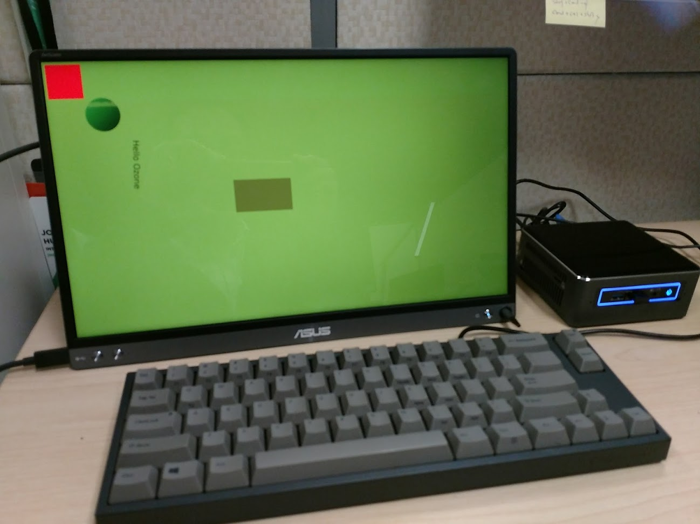

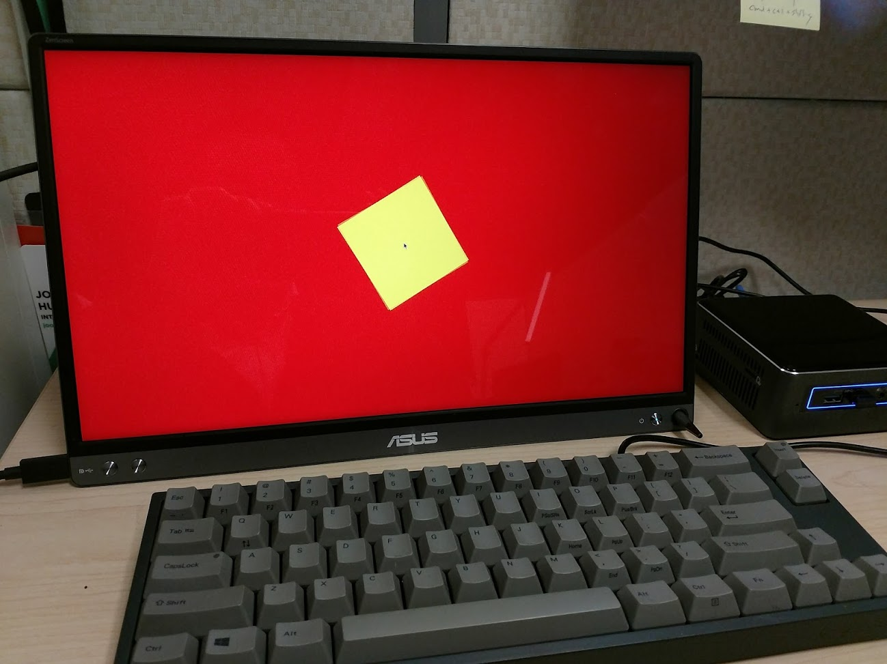

When you run ozone-gbm on Arch Linux, you do not need to modify the Linux Kernel and
Mesa. Some patches have already landed so the ozone_demo works as-is. If you want to
run the mus_demo, apply this
[patch](https://chromium-review.googlesource.com/c/chromium/src/+/1015224).

```bash
$ cd ~/git/chromium/src
$ gn gen out/Release "--args=use_ozone=true ozone_platform_gbm=true use_intel_minigbm=true build_display_configration=true"
$ ninja -C out/Release ozone_demo mash:all mus_demo
$ export EGL_PLATFORM=surfaceless
$ out/Release/ozone_demo --enable-drm-atomic --enable-overlay
$ out/Release/mash --service=mus_demo --enable-features=Mash
```

## Demo video

I created a youtube video that shows the performance difference between hardware
acceleration and software fallback, which can be viewed here:
[https://www.youtube.com/watch?v=CY7X6vWD_wo](https://www.youtube.com/watch?v=CY7X6vWD_wo)

## Future Plan

In Chromium M58, the Chromium browser worked on ozone-gbm. However, in Chromium M59
(and later), ozone-gbm functionality is broken on a Linux desktop. I plan to let
content_shell or chromium run on ozone-gbm with the latest Chromium for a Linux
desktop.

Special thanks to Dongseong Hwang, who originally implemented zero-copy texture
upload and video hardware overlay, for his review.
