, https://commons.wikimedia.org/w/index.php?curid=1587541")

> FYI: this article was originally published on [01.org](https://01.org/chromium/blogs/joone/2016/css-round-display-specifications).

Did you know that the first commercial computer monitor had a round display?
Digital Equipment's [PDP-1](http://history-computer.com/ModernComputer/Electronic/PDP-1.html)
(1959) was the first commercial computer equipped with a CRT monitor. As you can
see in the picture above, the display is round! However, since then, we have been
using rectangular displays for a long time. As computers have become smaller and
computer networking has become cheaper, computing and internet connectivity have
been integrated into many consumer electronic devices, from appliances to
wristwatches, that we collectively call Internet of Things (IoT) devices. Some of
these IoT devices use non-rectangular displays, so it's time for the round display
to make a comeback.

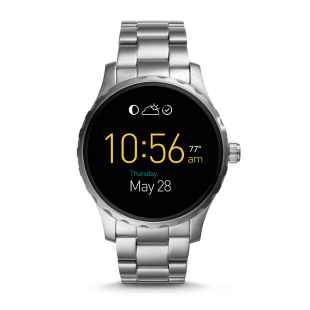

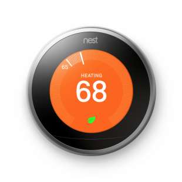

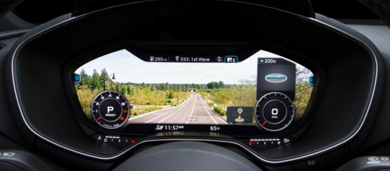

As you can see, smartwatches are the best examples of round displays. The NEST
thermostat also uses a round display. In addition, new Audi cars in model year
2017 have adopted a free form display in the dashboard.

## Web Standard

Many IoT devices use web engines to display their UIs, and many IoT devices
themselves are developed using web technologies. IoT developers can take advantage
of the familiarity, flexibility, and ease of development offered by these web
standards. But because some IoT devices have round displays, we need to let the web
know what kind of display is used in each device. Current web standards are
designed for rectangular displays, but since we need to take round display shapes
(circles and ellipses) into account for the web, the CSS Round Display
specifications use angle and radius values to position UI elements.

## CSS Round Display for Crosswalk

CSS Round Display is a set of W3C specifications that introduces a new media
query feature and new CSS properties. LG Electronics proposed these specifications
to the CSS working group for their smartwatch based on WebOS. The specifications
are currently in the [working draft 1 state](https://www.w3.org/TR/2016/WD-css-round-display-1-20160301/).
Intel joined the effort to apply the specifications to Crosswalk for Android
watches. [The Crosswalk Project](https://crosswalk-project.org/) is a web runtime
that enables web applications to run across Android, Windows, Linux platforms and
iOS. It even works well on Android Wear platforms, so web developers are able to
implement Android Wear applications using web technologies with Crosswalk.

## Overview of CSS Round Display Specifications

The CSS Round Display specification has seen some big changes recently.
Originally it was designed only for round displays, but now it has been extended to
cover the regular web by merging some of the properties into
[CSS Motion Path](https://www.w3.org/TR/motion-1/). As a result, the `motion-path`
property was renamed to `offset-path` to embrace the `polar-angle`,
`polar-distance`, `polar-anchor`, and `polar-origin` properties.

## Media Query: Shape Feature

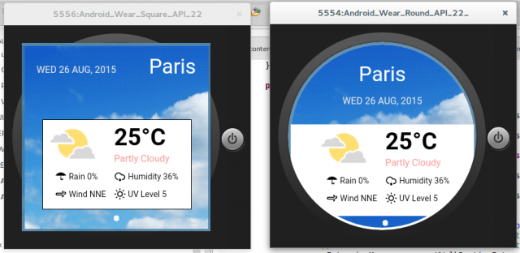

Additionally, the name of the Media Query feature was changed from `device-radius`
to `shape`. Its value was also changed from a percentage to the two reserved
values, `round` and `rect`.

If we use the `shape` feature in CSS, we can apply different CSS styles for round
displays as follows:

```html
<link href="rect.css" media="screen and (shape: rect)" rel="stylesheet" type="text/css">
<link href="circle.css" media="screen and (shape: round)" rel="stylesheet" type="text/css">
```

Currently, this feature can only work in Android Wear, which provides the
[`WindowInsets::isRound()`](https://developer.android.com/reference/android/view/WindowInsets.html#isRound())
method to know whether the display has a round shape or not. The return value of
this API is simple: the display is either rectangular or circular because those are
the two kinds of displays that are on the market. We changed the name and value
type of the feature for ease of use. If other display shapes are introduced in the
future, we might need to extend this functionality.

## Extending the @viewport Rule: The viewport-fit Descriptor

When web content is rendered in round displays, the corners of the content might
be clipped, causing users to need to scroll the web page to see the hidden area. To
see the whole viewport in the round display, we need to reduce the size of the
visual viewport to fit it inside the round display.

The `viewport-fit` rule was introduced in the spec as a descriptor of `@viewport`
to fix this problem. It allows us to control the clipped area by setting the size of
the visual viewport. You can see an example of this here:

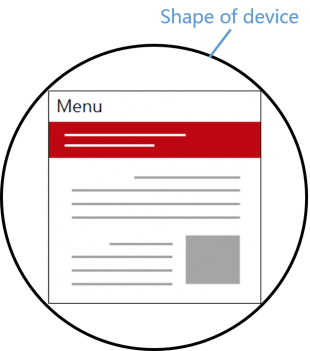

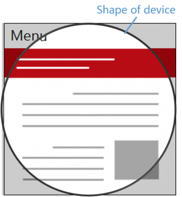

```css
@viewport { viewport-fit: contain; }
@viewport { viewport-fit: cover; }
```

## CSS offset-path and offset-distance

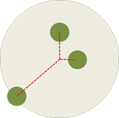

```html
<body>
  <div id="circle1" style="offset-path: 0deg; offset-distance: 50%"></div>
  <div id="circle2" style="offset-path: 90deg; offset-distance: 20%"></div>
  <div id="circle3" style="offset-path: 225deg; offset-distance: 100%"></div>
</body>
```

The `offset-path` property specifies the path at which the element gets
positioned. The angle value can be used. The `offset-distance` property specifies
the position of the element along the specified path. We can easily position
elements using the path and the distance in the path.

## CSS offset-position and offset-anchor

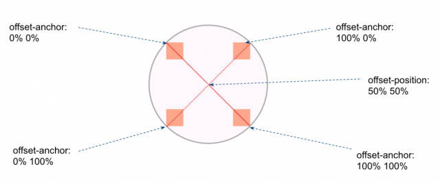

The `offset-position` sets a start point of the path in the containing block. The
`offset-anchor` property sets an anchor point of the element. We can change the
position of the element in the containing block in different ways.

## CSS offset-rotation

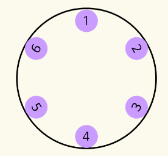

```html
<style>
  body { border-radius: 50%; }
  #item1 { offset-path: 0deg;   offset-distance: 90%; offset-rotation: auto 90deg; }
  #item2 { offset-path: 45deg;  offset-distance: 90%; offset-rotation: auto 90deg; }
  #item3 { offset-path: 135deg; offset-distance: 90%; offset-rotation: auto -90deg; }
  #item4 { offset-path: 180deg; offset-distance: 90%; offset-rotation: auto -90deg; }
  #item5 { offset-path: 225deg; offset-distance: 90%; offset-rotation: auto -90deg; }
  #item6 { offset-path: -45deg; offset-distance: 90%; offset-rotation: auto 90deg; }
</style>
```

If we use CSS `offset-rotation`, we can rotate elements toward the center or border
of the display by specifying the angle.

## CSS border-boundary

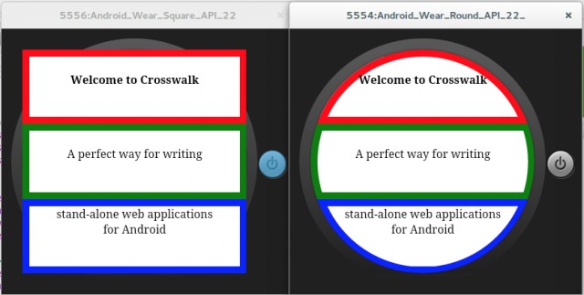

When we draw a border around elements in a round display, parts of the border can
be clipped off. So the spec added the CSS `border-boundary` property to paint the
border where the element and the display intersect. As you can see in the pictures
above, elements' borders can be drawn differently according to their location and
the display shape.

## Creating an Application Using CSS Round Display with Crosswalk

CSS Round Display has been experimentally implemented in Crosswalk for Android
Wear, so the latest changes of the specification were not applied.

## Creating a Package with Custom Built Crosswalk for Round Display

You can easily package your Crosswalk application with Crosswalk app tools using
the following steps:

1. Download [crosswalk_app_tools](https://github.com/crosswalk-project/crosswalk-app-tools)
   and set it up for Android.
2. Download the Crosswalk web runtime built with the CSS Round Display
   implementation
   ([x86](https://github.com/joone/crosswalk-round-display-samples/raw/master/crosswalk/crosswalk-19.49.506.0.x86-round-display.tar.gz),
   [ARM](https://github.com/joone/crosswalk-round-display-samples/blob/master/crosswalk/crosswalk-16.45.421.19-round-dsplay.tar.gz))
   for Android Wear.
3. Extract the package to `$HOME/Downloads/`.
4. Clone this repository and change to the directory:

```bash
$ git clone git@github.com:joone/crosswalk-round-display-samples.git
$ cd crosswalk-round-display-samples
```

Choose a sample directory and run crosswalk-pkg tools:

```bash
$ crosswalk-pkg -p android -c ~/Download/xwalk_app_template polar
$ adb install -r com.joone.polar-0.1-debug.x86.apk
```

For the shared mode, you can only package HTML, CSS, JS, and other resource files
without the Crosswalk engine. In this case, the Crosswalk engine is shared with
other Crosswalk web applications on Android. You can find the instructions below:

```bash
$ crosswalk-pkg -p android -a shared -c ~/Download/xwalk_app_template weather
```

You can download the Crosswalk engine for the shared mode at the links below:

- [X86](https://github.com/joone/crosswalk-round-display-samples/raw/master/crosswalk/XWalkRuntimeLibX86.apk)
- [ARM](https://github.com/joone/crosswalk-round-display-samples/raw/master/crosswalk/XWalkRuntimeLib.apk)

## Download CSS Round Display Demo Applications for Android Wear

You can download Crosswalk sample applications for Android Wear here:

- [https://github.com/joone/crosswalk-round-display-samples/tree/master/apk](https://github.com/joone/crosswalk-round-display-samples/tree/master/apk)

## Build Crosswalk for Android Wear

You can build Crosswalk for Android Wear and include the CSS Round Display features
with the instructions at the following links:

- [https://github.com/joone/wiki/wiki/Build-Crosswalk-for-Android-Wear](https://github.com/joone/wiki/wiki/Build-Crosswalk-for-Android-Wear)
- [https://crosswalk-project.org/contribute/building_crosswalk.html](https://crosswalk-project.org/contribute/building_crosswalk.html)

You need to create a `VERSION` file in
`crosswalk/src/out/Release/xwalk_app_template/`, which includes the following
information:

```
MAJOR=16
MINOR=45
BUILD=421
PATCH=19
```

Then build `xwalk_app_template`, which includes the Crosswalk runtime.

```bash
$ ninja -C out/Release xwalk_app_template
```

Now you have a custom-built Crosswalk with CSS Round Display features. You can use
it to package your Android Wear application instead of using the downloaded runtime.

```bash
$ crosswalk-pkg -p android -c ~/git/crosswalk/src/out/Release/xwalk_app_template polar
```

## Demos

Here are some demos of Crosswalk for CSS Round Display on Fossil Android Wear based
on an X86 processor.

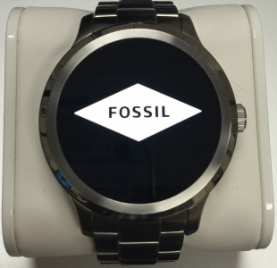

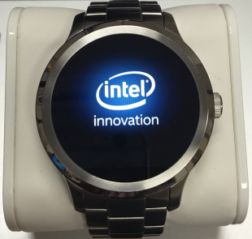

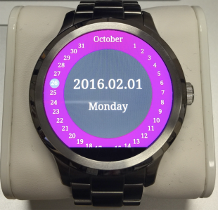

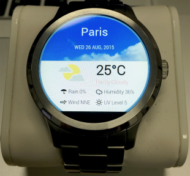

## Browsing the Web on Android Watch

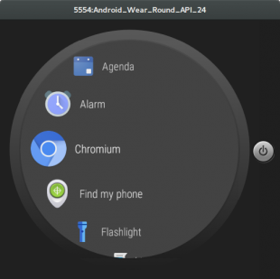


Android 2.0 was introduced in the last Google I/O developer conference. Android 2.0
is able to access a network without using an Android smartphone as an intermediary
device. For now, we are able to run the Chromium browser and use it to browse the
web, as you can see from the pictures above. From a user's perspective, it is not
easy to browse the web like this because the browser UI and virtually all web pages
were made for rectangular displays only. Just as it took many years for web
browsing on phones to catch up with the desktop experience, it might take time for
people to learn how to easily browse the web with their round display devices. CSS
Round Display specifications will help accelerate this transition.

## Upstreaming the Work

Many features of CSS Round Display were experimentally implemented in Crosswalk,
but they were not applied to the Crosswalk trunk. Instead, those changes will be
upstreamed directly to Chromium. LG, Google, and Intel are working to implement
these changes in the spec and to develop working demos in Chromium soon.

## References

1. [https://drafts.csswg.org/css-round-display/](https://drafts.csswg.org/css-round-display/)
2. [https://github.com/anawhj/jRound](https://github.com/anawhj/jRound)
3. [https://github.com/joone/crosswalk-round-display-samples/tree/master/apk](https://github.com/joone/crosswalk-round-display-samples/tree/master/apk)

*Other names and brands may be claimed as the property of others.*
