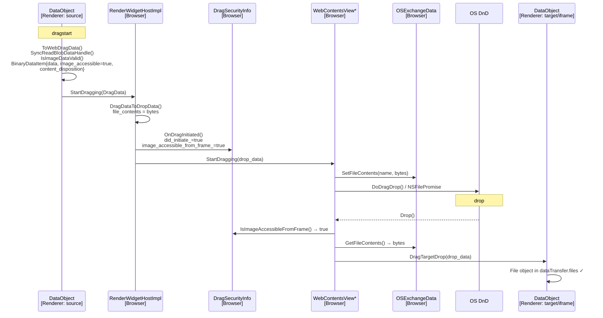

- **Tracking bug:** [Support dragging constructed Files across renderers (41120809)](https://issues.chromium.org/issues/41120809)
- **Main CL:** [Support dragging JS File objects to native drop targets (7603160)](https://chromium-review.googlesource.com/c/chromium/src/+/7603160)
- **Windows CL:** [Win: Support TYMED_ISTREAM for CFSTR_FILECONTENTS in GetFileContents (7566722)](https://chromium-review.googlesource.com/c/chromium/src/+/7566722)
- **Mac CL:** [mac: Support dragging JS File objects across webviews and apps (7689255)](https://chromium-review.googlesource.com/c/chromium/src/+/7689255/34)
- **Chrome Status:** [feature/5197936839491584](https://chromestatus.com/feature/5197936839491584)
- **Runtime flag:** `DragAndDropJSFileObjects` (disabled by default). Enable with `--enable-blink-features=DragAndDropJSFileObjects`

---

## TL;DR

Today, when a web app places a JavaScript-constructed `File` object —
`new File([bytes], 'photo.jpg')` — into a `dragstart` handler via
`DataTransfer.items.add()`, the blob bytes are **silently discarded** in
`DataObject::ToWebDragData()`. The drag carries metadata but no payload, so:

- Dropping onto a **native application** (e.g. MS Word and OneNote) delivers nothing.
- Dropping onto an **iframe in the same tab** yields `dataTransfer.files.length == 0`.

Constructing and dragging a `File` is the clean, standards-compliant way for a
web app to initiate a file transfer. The app builds a `File` in
JavaScript — from user input, a `<canvas>`, or a `fetch()` response — and adds it
to the drag; the browser is responsible for delivering the bytes to whatever the
user drops onto:

```js
element.addEventListener('dragstart', e => {
  const bytes = new Uint8Array([...]);  // or from fetch()/ArrayBuffer/canvas
  const file = new File([bytes], 'image.png', { type: 'image/png' });
  e.dataTransfer.items.add(file);
});
```

Firefox already delivers such constructed `File`s to native Windows apps
correctly. Chromium previously discarded the bytes and delivered only the
filename as `text/plain`, making the drop useless for native targets.

This design reads the blob bytes synchronously at drag-start, forwards them
through the existing drag IPC pipeline as a `BinaryDataItem`, and delivers them
to the OS via the platform file-contents path (`CFSTR_FILECONTENTS` on
Windows, `NSFilePromise` on macOS).

The initial scope is **image MIME types only**, gated by magic-byte validation,
behind a disabled-by-default runtime flag.

---

## 1. Introduction

Drag-and-drop is one of the oldest and most intuitive interactions in graphical
user interfaces, dating back to the early desktop environments of Windows and
Macintosh in the 1990s. Its directness — pick something up and drop it where you
want it — is exactly why it remains a core part of how users move data between
applications today.

The web platform has long supported drag-and-drop, but it was designed primarily
to work *within* a web page. Interactions that cross the boundary between the
browser and native applications are limited to a few special cases: dragging an
image out of a page, dragging a URL link out to another application, or
dropping a file from the OS file manager into the browser. As a result, many
WebView-based applications that look and feel like native apps fall short of user
expectations, because drag-and-drop is not fully supported at the browser level.

The goal of this design is to close that gap by supporting a new scenario:
dragging a JavaScript `File` object out of the browser and dropping it onto a
native application. This document describes how that is implemented.

For reference, Firefox already supports dragging constructed `File` objects out
of the browser, so this change aligns Chromium with existing cross-browser
behavior using the **existing** `DataTransfer` API — no new JS surface is
introduced.

### Goals

- Deliver bytes of a JS-constructed `File` to native OS drop targets.
- Make intra-tab (parent frame → iframe) drops of constructed `File`s work.
- Enforce content-based security validation (magic bytes), not filename trust.
- Cross-platform: Windows, Linux, ChromeOS, macOS (Android tracked separately).

### Non-Goals

- No new JavaScript API. Streaming/async drag API is explicitly out of scope and
  tracked as future work (see §8).
- No support for non-image MIME types in V1.
- No multi-file (`CFSTR_FILECONTENTS` index > 0) support in V1.
- No solution for the Mark-of-the-Web (MOTW) gap in V1 (documented & accepted).

---

## 3. Background

A drag's data lives in `blink::DataObject` (renderer). Each item is a
`DataObjectItem`. A constructed `File` has `kFileKind` but **no backing file on
disk** — its bytes live in a `BlobDataHandle`. `ToWebDragData()` historically hit
an unimplemented TODO for this case and fell back to a plain-text `StringItem`
carrying only the filename:

```cpp
// TODO(http://crbug.com/394955): support dragging constructed Files
// across renderers.
auto& string_item = item_list[i].emplace<WebDragData::StringItem>();
string_item.type = "text/plain";
string_item.data = file->name();   // ← filename only, no bytes
```

so native applications received only a text string, not a droppable file.

The drag pipeline crosses process boundaries. At drag-start the browser hands the
drag to the platform's OS drag-and-drop loop — `DoDragDrop()` on Windows,
`NSDraggingSession` / `NSFilePromise` on macOS, and the equivalent drag session
on Linux/ChromeOS. Where the user drops then determines the path:

```
Drop on a NATIVE APP (out-of-browser):
  Renderer (source) ─StartDragging─► Browser ─► OS drag loop ─► native drop target
                                                 (DoDragDrop / NSFilePromise / …)

Drop on ANOTHER RENDERER (in-browser, e.g. parent frame → iframe):
  Renderer (source) ─StartDragging─► Browser ─► OS drag loop
                                          │  (on drop)
                                          ▼
                     Browser ─DragTargetDrop─► Renderer (target / iframe)
```

The second case is the **in-browser** drag-and-drop scenario: the drop is routed
back into a renderer (for example, a parent frame dropping onto an iframe in the
same tab). The first case delivers the file bytes to a native application outside
the browser. Both share the same source-side path; only the drop destination
differs.

The platform delivery primitive already exists: `PrepareDragForFileContents()`
→ `OSExchangeDataProvider::SetFileContents()` stores `CFSTR_FILECONTENTS`. It was
previously only fed by in-page image drags (e.g. dragging an ``).

---

## 4. Architecture Overview

The sequence below traces the **in-page (intra-tab) drag-and-drop** path — a
constructed `File` dragged from a source frame and dropped onto another renderer
(e.g. an iframe in the same tab), ending with the bytes exposed as
`dataTransfer.files`. The source-side steps (`dragstart` → `ToWebDragData()` →
`StartDragging` → `SetFileContents` → `DoDragDrop()`/`NSFilePromise`) are shared
with the native-app drop; only the drop destination differs — a native
application receives the bytes directly from the OS via `CFSTR_FILECONTENTS` /
`NSFilePromise` instead of routing back through `DragTargetDrop`.



---

## 5. Detailed Design

### 5.1 Renderer: read & validate blob bytes

**File:** `third_party/blink/renderer/core/clipboard/data_object.cc`

In `ToWebDragData()`, for a `kFileKind` item with **no disk path** (a blob-backed
constructed `File`), and only when the runtime feature is enabled:

```cpp

WebDragData DataObject::ToWebDragData(ExecutionContext* context) {
  WebDragData data;
  std::vector<WebDragData::Item> item_list(length());

  for (wtf_size_t i = 0; i < length(); ++i) {
    DataObjectItem* original_item = Item(i);
    WebDragData::Item& item = item_list[i];
    switch (original_item->Kind()) {
      case DataObjectItem::kStringKind: {
       ...
      case DataObjectItem::kFileKind: 
        if (original_item->GetSharedBuffer()) {
          ...
        }  else if (original_item->IsFilename()) {
          ...
          scoped_refptr<SharedBuffer> buf;
          if (context &&
              RuntimeEnabledFeatures::DragAndDropJSFileObjectsEnabled(context)) {
            auto task_runner = context->GetTaskRunner(TaskType::kFileReading);
            buf = SyncReadBlobDataHandle(file->GetBlobDataHandle(),
                                        std::move(task_runner));
          }
          if (buf && buf->size() > 0 && IsImageDataValid(buf)) {
            auto& binary_item = item_list[i].emplace<WebDragData::BinaryDataItem>();
            binary_item.data = buf;
            binary_item.image_accessible = true;  // see §6.1
            if (!file->name().empty()) {
              // (A) Synthesize a source URL whose last path component is the
              // filename. The in-page drop target recovers the name via
              // base_url_.LastPathComponent(), and Windows/Linux derive the
              // dropped file's name from it. See §5.4.
              binary_item.source_url =
                  KURL(StrCat({"https://local/",
                               EncodeWithUrlEscapeSequences(file->name())}));
              // (B) Also carry the (escaped) name as a Content-Disposition.
              // Required by the macOS pasteboard path. See §5.4.
              String escaped_name = file->name();
              escaped_name = escaped_name.Replace("\\", "\\\\");
              escaped_name = escaped_name.Replace("\"", "\\\"");
              binary_item.content_disposition =
                  "attachment; filename=\"" + escaped_name + "\"";
            }
            // (C) Preserve the extension for the image-MIME gate + final name.
            const String& name = file->name();
            size_t dot_index = name.rfind('.');
            if (dot_index != kNotFound && dot_index + 1 < name.length()) {
              binary_item.filename_extension = name.substr(dot_index + 1);
            }
          }
```

**`SyncReadBlobDataHandle()`** — synchronous read via
`SyncedFileReaderAccumulator::Load()`, capped at a hard limit:

```cpp
// 256MB is a common upper bound for synchronous memory-backed DnD operations.
constexpr size_t kMaxSyncReadSize = 256 * 1024 * 1024;
```

**`IsImageDataValid()`** — content validation using `ImageDecoder::Create()`
(signature sniffing only, no full decode). Returns false if the bytes don't match
a supported image format, so `new File([exeBytes], 'malware.png')` is rejected
regardless of filename. This mirrors the Async Clipboard API
(`clipboard_writer.cc`). See §6.2.

### 5.2 IPC: carry bytes to the browser

`WebDragData::BinaryDataItem` → mojo `DragItemBinary` → `DragDataToDropData()`:

content/browser/renderer_host/data_transfer_util.cc

```cpp

DropData DragDataToDropData(const blink::mojom::DragData& drag_data) {
  ...
  for (const blink::mojom::DragItemPtr& item : drag_data.items) {
    switch (item->which()) {
      ...
      case blink::mojom::DragItemDataView::Tag::kBinary: {
        // DropData only supports a single file_contents entry.
        // Skip additional binary items until multi-file support is added.
        if (!result.file_contents.empty()) {
          break;
        }

        const blink::mojom::DragItemBinaryPtr& binary_item = item->get_binary();
        base::span<const uint8_t> contents(binary_item->data);
        result.file_contents.assign(contents.begin(), contents.end());
        result.file_contents_image_accessible =
            binary_item->is_image_accessible;
        result.file_contents_source_url = binary_item->source_url;
        result.file_contents_filename_extension =
            binary_item->filename_extension.BaseName().value();
        if (binary_item->content_disposition) {
          result.file_contents_content_disposition =
              *binary_item->content_disposition;
        }
        break;
      }
  ...
}
```

### 5.3 Browser: prepare the drag source

**File:** `content/browser/web_contents/web_contents_view_aura.cc` (Aura) /
`web_contents_view_mac.mm` (Mac).

`StartDragging()` → `PrepareDragData()` → `PrepareDragForFileContents()`:

```cpp
#if BUILDFLAG(IS_LINUX) || BUILDFLAG(IS_CHROMEOS) || BUILDFLAG(IS_WIN)
  // GetSafeFilenameForImageFileContents() derives the filename, then:
  provider->SetFileContents(filename, drop_data.file_contents);
#endif
```

On Windows, `OSExchangeDataProviderWin::SetFileContents()` stores
`CFSTR_FILECONTENTS` as `TYMED_ISTREAM` (backed by an in-memory `IStream`).

**Windows storage medium: `TYMED_ISTREAM` (CL [7566722](https://chromium-review.googlesource.com/c/chromium/src/+/7566722)).**
Chromium historically stored `CFSTR_FILECONTENTS` as `TYMED_HGLOBAL`, but the
Windows Shell specification recommends `TYMED_ISTREAM` (paired with
`CFSTR_FILEDESCRIPTORW`) for interoperability. Native apps such as OneNote,
and Word request `CFSTR_FILECONTENTS` with `TYMED_ISTREAM` and fail
silently when only `TYMED_HGLOBAL` is offered. Three coordinated changes fix
this:

1. **Replace `FileContentZeroType()` with `FileContentAtIndexType(0)`.** The
   former hardcoded `TYMED_HGLOBAL` and is removed; the latter advertises
    `TYMED_HGLOBAL | TYMED_ISTREAM | TYMED_ISTORAGE`, matching the spec.
2. **Store as `TYMED_ISTREAM` in `SetFileContents()`.** A new helper
    `CreateStorageForIStream()` wraps the bytes in an `IStream` via
    `SHCreateMemStream()`. The `DuplicateMedium()` path resets the stream seek
    position to zero so every `IDataObject::GetData()` caller reads from the
    start.
 3. **Read `TYMED_ISTREAM` in `GetFileContents()` (drop-target side).** When
    Chromium *receives* `CFSTR_FILECONTENTS`, a `ReadStreamToString()` helper
    reads the `IStream` into a `std::string`, capped at 256 MB
    (`kMaxClipboardStreamSize`) to prevent OOM. This lets Chromium accept
    virtual files from apps that only provide `TYMED_ISTREAM`.

`OnDragInitiated()` records the security state:

```cpp
did_initiate_ = true;
image_accessible_from_frame_ = drop_data.file_contents_image_accessible; // true
```

### 5.4 Filename derivation & macOS pasteboard delivery

The renderer sets three filename-related fields on the binary item (§5.1), and
each platform consumes them differently:

| Field | Set by | Value | Consumed by |
|---|---|---|---|
| `source_url` | main CL | `https://local/<encoded name>` | in-page drop (`LastPathComponent`) + Windows/Linux filename |
| `content_disposition` | macOS CL | `attachment; filename="photo.jpg"` | macOS pasteboard / `NSFilePromise` |
| `filename_extension` | main CL | `jpg` | image-MIME gate + final extension |

`DropData::GetSafeFilenameForImageFileContents()` turns these into a sanitized
name on every platform:

```cpp
base::FilePath file_name = net::GenerateFileName(
    file_contents_source_url,            // "https://local/photo.jpg"
    file_contents_content_disposition,   // "attachment; filename=photo.jpg"
    ...);
return file_name.ReplaceExtension(file_contents_filename_extension);  // "photo.jpg"
```

`net::GenerateFileName` prefers the `Content-Disposition` filename and otherwise
falls back to the URL's last path component — so either field alone yields
`photo.jpg`.

**Windows / Linux.** `PrepareDragForFileContents()` calls
`GetSafeFilenameForImageFileContents()` and hands the result to
`OSExchangeDataProviderWin::SetFileContents()`, which writes the name into the
`CFSTR_FILEDESCRIPTORW` file descriptor (`fgd[0].cFileName`) that pairs with the
`CFSTR_FILECONTENTS` bytes. The name is derived in-process from `source_url`
(+ extension); `content_disposition` is **not** required on this path.

**macOS (CL [7689255](https://chromium-review.googlesource.com/c/chromium/src/+/7689255/34)).**
The Mac path needs `content_disposition` for two distinct reasons:

1. **Constructed Files have no natural origin URL.** Before `source_url` was
   synthesized, `file_contents_source_url` was empty, so
   `net::GenerateFileName(GURL(), ...)` produced nothing,
   `GetSafeFilenameForImageFileContents()` returned `std::nullopt`, and the
   entire filename-gated `NSFilePromise` block in `web_drag_source_mac.mm` was
   skipped — delivering no file. Carrying the name in `content_disposition`
   restored a usable filename + MIME type.
2. **The NSPasteboard hop loses `DropData` fields.** On macOS the drag is
   serialized onto the OS pasteboard as a set of registered flavors; only those
   explicitly added in `writableTypesForPasteboard:` survive. `source_url` is an
   internal `DropData` field and is **never** written as a flavor, so a
   receiving webview cannot see it. The Mac CL therefore registers a dedicated
   `kUTTypeChromiumContentDisposition` flavor that carries the filename string
   across the hop, and synthesizes a `file://` URL from it on the receiving side
   so the target renderer can rebuild the `File`'s name.

In short: Windows bakes the `source_url`-derived name into the file descriptor
in-process, whereas macOS must round-trip the name through the pasteboard — which
is why `content_disposition` was introduced for the Mac path.

### 5.5 Drop side: deliver to the target

**File:** `web_contents_view_aura.cc` → `PrepareDropData()`:

```cpp
if (drag_security_info_.IsImageAccessibleFromFrame()) {       // §6.1
  if (auto fc = data.GetFileContents(); fc.has_value()) {
    drop_data->file_contents = fc->bytes;
    drop_data->file_contents_source_url = fc->url;
  }
}
```

Then `DragTargetDrop()` → iframe/target renderer → `DataObject::Create()`
reconstructs a `SharedBuffer`-backed `File`, exposed as
`e.dataTransfer.files[0]`.

### 5.6 Platform delivery matrix

| Aspect | Windows | macOS |
|---|---|---|
| Protocol | COM `IDataObject` / `CFSTR_FILECONTENTS` | `NSPasteboard` / `NSFilePromise` |
| Storage medium | `TYMED_ISTREAM` (in-memory `IStream`) | `NSData` or promised file |
| Transfer timing | Pre-loaded during `DoDragDrop()` modal loop | Written after drop, on thread pool |
| Extra fix needed | No | Yes — `content_disposition` (§5.4) |
| Status | Implemented | Separate CL ([7689255](https://chromium-review.googlesource.com/c/chromium/src/+/7689255)) |
| Android | Not supported — tracked separately | — |

---

## 6. Security Considerations

This is a web-facing capability change (data leaves the renderer sandbox to
native apps) and goes through the Blink Intent / launch process.

### 6.1 Cross-frame access gate (`image_accessible`)

`WebContentsViewDragSecurityInfo::IsImageAccessibleFromFrame()` gates whether
`file_contents` is populated on drop. For intra-tab drags it returns
`image_accessible_from_frame_`; for external drops (`did_initiate_ == false`) it
returns `true`.

The renderer sets `binary_item.image_accessible = true` **only after** it has
successfully read the blob synchronously. This is safe because:

- A renderer can only read blob data it already owns; cross-origin fetches
  require CORS and would have been blocked before the bytes reached the renderer.
- `IsValidDragTarget()` (site-instance-group comparison) independently restricts
  intra-tab drops to same-site-instance frames at the browser level.

Leaving it `false` (the original behavior) blocked all intra-tab iframe drops.

### 6.2 Content validation (magic bytes) — defense in depth

| Layer | Check |
|---|---|
| Renderer (Blink) | `ImageDecoder::Create()` rejects non-image signatures (§5.1) |
| Browser | `GetSafeFilenameForImageFileContents()` image-extension gate |

Both layers are retained so that removing one does not open an `.exe`-as-image
exfiltration path. A `TODO(crbug)` tracks tightening the renderer gate to an
explicit MIME allowlist (`image/png`, `image/jpeg`, `image/gif`, `image/webp`).

A future broadening to other types would use `net::SniffMimeTypeFromLocalData()`
(catches `MZ` EXE headers, ZIP, PDF, etc.), pending a layering review of a
`net/` dependency inside Blink. Each new type requires its own security review;
`application/octet-stream` is blocked outright.

**File-type gate.** `GetSafeFilenameForImageFileContents()` decides which
extensions pass through `CFSTR_FILECONTENTS` by mapping the extension to a MIME
type; today only image types are allowed, and files that fail the gate fall back
to `text/plain` (filename only). Additional MIME types can be enabled for
privileged WebView embedders via *web content privilege mode* — e.g. PDF support
in CL [7610732](https://chromium-review.googlesource.com/c/chromium/src/+/7610732).

### 6.3 Mark of the Web (MOTW) gap — documented limitation

Files delivered via `CFSTR_FILECONTENTS` / `NSFilePromise` are written to disk by
the **receiving** app, bypassing Chromium's download pipeline. Therefore:

- No `Zone.Identifier` ADS is written.
- SmartScreen / AV scanning is not triggered.
- No "this file came from the internet" warning is shown.

MOTW **cannot** be applied at the source: it requires an on-disk NTFS file, but
the drag source is an in-memory blob. This is inherent to the transfer mechanism.
For the image-only V1, the gap is accepted and explicitly flagged for the Blink
security review. Future mitigations to evaluate: a permission prompt, restricting
drop targets to known-safe processes, or post-drop MOTW tagging.

### 6.4 Resource limits

Synchronous read is capped at 256 MB (§5.1) to bound memory and UI-thread stall
at drag-start.

---

## 7. Testing

### Web Platform Tests
- `wpt/js-file-image-drag.html` — valid image `File` drags & delivers bytes.
- `wpt/js-file-non-image-drag.html` — disguised/non-image `File` is rejected.

### Unit / browser tests
- `image_accessible = true` for validated blob image items (renderer).
- Intra-tab parent → iframe drop delivers a non-empty `files` list.
- Cross-window drop continues to work (`did_initiate_ == false` path).
- `content_disposition` produces a correct filename + MIME on Mac.
- `IsImageDataValid()` rejects `MZ`/non-image bytes regardless of extension.

### Manual / integration
- Drop onto OneNote/Word (image), Explorer, macOS Preview/Mail.
- Legacy/native targets verified per platform.

---

## 8. Future Work

- **Async/streaming drag API.** A sync-shaped contract is an outlier among file
  APIs. V1 keeps the sync read as an unobservable internal detail (no new JS
  API), and a future additive streaming API (`IStream`-backed on Windows) is the
  long-term direction. See round-2 review discussion.
- **Broader MIME types** via `net::SniffMimeTypeFromLocalData()` + per-type
  review (§6.2).
- **Multi-file** `CFSTR_FILECONTENTS` (e.g. dragging multiple Outlook Web
  attachments) — requires `TYMED_ISTORAGE`. Tracked in
  [crbug 41451800](https://crbug.com/41451800).
- **Android** delivery path.
- **MOTW mitigations** (§6.3).

---

## 9. References

### Chromium issue
- [Support dragging constructed Files across renderers (41120809)](https://issues.chromium.org/issues/41120809)

### Chromium patches
- [Support dragging JS File objects to native drop targets (7603160)](https://chromium-review.googlesource.com/c/chromium/src/+/7603160)
- [mac: Support dragging JS File objects across webviews and apps (7689255)](https://chromium-review.googlesource.com/c/chromium/src/+/7689255/34)
- [Win: Support TYMED_ISTREAM for CFSTR_FILECONTENTS in GetFileContents (7566722)](https://chromium-review.googlesource.com/c/chromium/src/+/7566722)
- [DND: Allow PDF files when dragging JS-constructed File objects (7610732)](https://chromium-review.googlesource.com/c/chromium/src/+/7610732)

