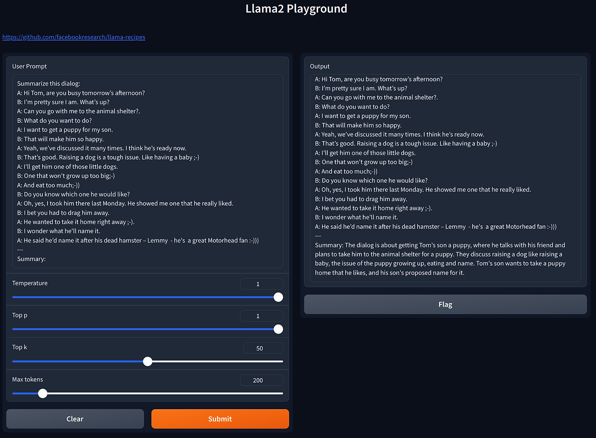

I'm excited to share my recent contribution to the [llama-recipes](https://github.com/facebookresearch/llama-recipes), a project used for fine-tuning Llama2.

I've been working on fine-tuning [the Lamma model](https://llama.meta.com/) since its open-source release. Initially, I utilized [the alpaca-lora project](https://github.com/tloen/alpaca-lora), which enabled fine-tuning Lamma using a consumer's NVidia GPU. This was a significant advantage as it allowed me to develop my own version of ChatGpt. However, the LLM industry moves at a rapid pace: Meta released Lamma2 shortly after. In this release, Meta also introduced a new tool on GitHub named Lamma-recipes, prompting me to transition to this new tool for further fine-tuning.

The Llama-recipes tool provides a method to fine-tune the model with the alpaca_dataset, sourced from ChatGPT, effectively allowing the model to mimic ChatGPT's functionality. Here's a brief guide on using llama-recipes for fine-tuning:

```bash
$ cd ~/git/llama-recipes
$ cp ~/Downloads/alpaca_data.json ~/git/llama-recipes/src/llama_recipes/datasets
$ python -m llama_recipes.finetuning  --use_peft --peft_method lora --quantization --batch_size_training=2 --model_name ../models/Llama-2-7b-hf/ --dataset alpaca_dataset  --output_dir outputs/7b
```

For inference, if you have a file like `chatgpt.txt`:

```plaintext
Below is an instruction that describes a task, paired with an input that provides further context. Write a response that appropriately completes the request.

### Instruction:
Classify the following into animals, plants, and minerals

### Input:
Oak tree, copper ore, elephant
```

You can perform inference with the following command:

```bash
$ cat chatgpt.txt |  python3 examples/inference.py --model_name ../models/Llama-2-7b-hf --peft_model outputs/7b --max_new_tokens 580  --quantization true
```

Alternatively:

```bash
$ python3 examples/inference.py --model_name '../models/Llama-2-7b-hf'  --quantization true  --prompt_file chatgpt.txt
```

To streamline the process, I integrated a Gradio web UI similar to what alpaca-lora provided, making it more user-friendly.

```bash
$ python3 examples/inference.py --model_name '../models/Llama-2-7b-hf' --peft_model 'outputs/7b' --max_new_tokens 580  --quantization true
Running on local URL:  http://0.0.0.0:7860
Running on public URL: https://???????????.gradio.live

This share link expires in 72 hours. For free permanent hosting and GPU upgrades, run `gradio deploy` from Terminal to deploy to Spaces (https://huggingface.co/spaces)
```


I submitted a pull request to integrate Gradio web interface support into the llama-recipes project, which was successfully merged along with other bug fixes:

* [Add gradio library for user interface in inference.py](https://github.com/facebookresearch/llama-recipes/pull/367)
* [Add gradio to requirements.txt](https://github.com/facebookresearch/llama-recipes/pull/384)
* [Add option to enable Llamaguard content safety check in chat_completion](https://github.com/facebookresearch/llama-recipes/pull/354)

Contributing to open source projects is always fun. This contribution is particularly meaningful to me because it goes beyond my usual domain of web browsers.
