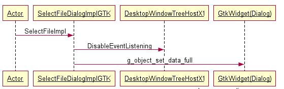
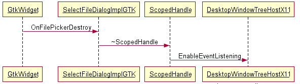

When I started working on Chromium, I found a bug in Chromium for Linux: the
file-picker was not modal. So, while a file-picker was open, the user could
still control the main window. Sometimes this caused misbehavior — for example,
you could send an email while still attaching a file.

There was already [a bug filed](https://bugs.chromium.org/p/chromium/issues/detail?id=408481)
and it seemed easy to fix, but it took two years to fully resolve.

The root cause is as follows.

Chromium for Linux uses `GtkFileChooserDialog` to open a file-picker, but it is
not modal to the X11 host window because `GtkFileChooserDialog` can only be modal
to its parent `GtkWindow`. So I tried to let the X11 host window disable input
event handling to make the file-picker modal. Here are the details.

## Opening a file-picker



`DisableEventListening()` disables event listening for the host window using
`aura::ScopedWindowTargeter`, which temporarily replaces the event targeter with
`ui::NullEventTargeter`. It returns a scope handle that is used to call
`destroy_callback` when the file-picker closes.

```cpp
class ScopedHandle {
 public:
  explicit ScopedHandle(const base::Closure& destroy_callback);
  ~ScopedHandle();
  void CancelCallback();

 private:
  base::Closure destroy_callback_;
  DISALLOW_COPY_AND_ASSIGN(ScopedHandle);
};
```

In addition, we also set another destroy callback (`OnFilePickerDestroy`) on the
`GtkFileChooserDialog` that is called when the file-picker is closed.

## Closing the file-picker



As you can see, `OnFilePickerDestroy` deletes `scoped_handle`.

```cpp
void OnFilePickerDestroy(views::DesktopWindowTreeHostX11::ScopedHandle*
                             scoped_handle) {
  delete scoped_handle;
}
```

Then the `destroy_callback` of `ScopedHandle` below is automatically called.

```cpp
void DesktopWindowTreeHostX11::EnableEventListening() {
  DCHECK(modal_dialog_xid_);
  modal_dialog_xid_ = 0;
  targeter_for_modal_.reset();
}
```

You can find more details and discussion in
[this design doc](https://docs.google.com/document/d/12CfKVTpaonxxM3sNksq6vY6qb0J2qR3b7h_bLxzYanE/edit#).

[The first change list was reverted](https://codereview.chromium.org/1594973009)
due to a UI-freezing problem that happened when the user opened a file-picker
from a child window of the X11 host window.
[The second change list](https://codereview.chromium.org/1624793002/) finally
fixed this issue (BUG 408481, 579408). I also added a test case for the fix:
[BrowserSelectFileDialogTest.ModalTest](https://cs.chromium.org/chromium/src/chrome/browser/ui/libgtkui/select_file_dialog_interactive_uitest.cc?l=74&ct=xref_jump_to_def&gsn=MAYBE_ModalTest).
