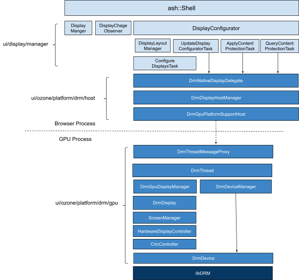
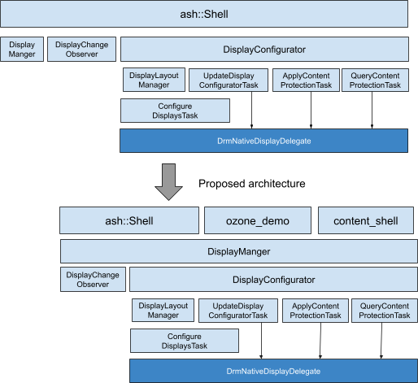
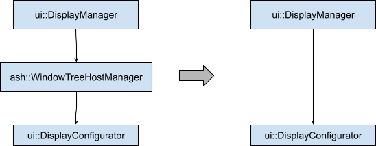

Joone Hur (joone.hur@intel.com, joone@chromium.org) — March 4, 2019

## Introduction

In theory, applications with Ozone in Chromium can choose its backends such as
X11, DRM/GBM, Wayland, or headless at runtime. However, if we build a
`content_shell` with the ozone-gbm (DRM/GBM) backend, there is nothing to be
rendered on the screen because displays are not configured. The main reason is
that a display configurator is not implemented for ozone-gbm clients by default.
Therefore, if we want to render the UI of ozone-gbm clients, each ozone-gbm client
has to implement its own display configurator like `ozone_demo` does. However, each
client will have the same display configuration handlers, which is inefficient.
Also, display management features such as multiple display support, HDCP, and
display layout manager are already implemented in CrOS, so we need a way to share
those features with non-CrOS applications such as digital signage, kiosk, IVI,
set-top box, digital TV, IoT systems, etc.

This document describes how to implement a single interface for ozone-gbm clients
to configure displays with the CrOS `DisplayManager` and `DisplayConfigurator`, and
how it can be used in ozone-gbm clients.

## Goal

1. Provide a single interface for managing and configuring displays for ozone-gbm
   clients.
2. Allow ozone-gbm clients such as CrOS, `ozone_demo`, etc. to use the interface.

## Current CrOS Architecture for Display Management



`ash::Shell` owns `DisplayManager` and `DisplayConfigurator`. It also depends on
`ui::DisplayChangeObserver`, which is used to create display information to pass it
to `DisplayManager` from `ui::DisplayConfigurator` by observing display
configuration callbacks.

However, we need to have a single interface for configuring displays so that any
ozone-gbm client can use the display configuration feature more easily.

## Proposed Architecture



### Let DisplayManager own DisplayConfigurator (Done)



```cpp
bool DisplayManager::SetDisplayMode(int64_t display_id,
                                    const ManagedDisplayMode& display_mode) {
  ...
#if defined(OS_CHROMEOS)
  else if (resolution_changed && configure_displays_)
    delegate_->display_configurator()->OnConfigurationChanged();
#endif
  ...
}
```

Currently, `ui::DisplayManager` interacts with `ui::DisplayConfigurator` through
`ash::WindowTreeHostManager`, but it can directly access `ui::DisplayConfigurator`
by allowing `DisplayManager` to own `DisplayConfigurator`. So, we could avoid
chaining function calls in the above code.

### Single Interface for Display Configuration and Management

`ui::DisplayManager` can be the single interface for ozone-gbm clients by moving
`DisplayConfigurator` and `DisplayChangeObserver` under `DisplayManager`, which can
simplify the interface between the CrOS shell and `ui/display/manager`. Ozone-gbm
clients can easily use display configuration/management features by only accessing
`DisplayManager`.

### Set a callback instead of creating a NativeDisplayObserver

In this architecture, ozone-gbm clients will not have a `NativeDisplayObserver`, so
there is no way to observe the change of display configuration. Instead, we can set
a callback function in `DisplayManager` so that the callback function can be
triggered when a display is configured.

## Implementation

### 1st phase: separate Display Configuration code from CrOS (Done)

First, we need to separate the display configuration code from CrOS by introducing
the `build_display_configuration` build flag so that it could be easily enabled for
any ozone-gbm clients, which was already committed to the trunk:

[https://chromium.googlesource.com/chromium/src/+/d3ae8737f7186154d2fdc3ccc5fe43bf290f91b5](https://chromium.googlesource.com/chromium/src/+/d3ae8737f7186154d2fdc3ccc5fe43bf290f91b5)

This CL moved all files in `ui/display/manager/chromeos` to `ui/display/manager` and
adds the `build_display_configuration` GN arg.

### 2nd phase: Add DISPLAY_CONFIGURATION macro

However, if we try to build `content_shell` with `build_display_configuration`
without `OS_CHROMEOS`, there are still build breaks because some of the display
configuration code belongs to the CrOS build, so we need to separate that code from
the CrOS build by introducing the `DISPLAY_CONFIGURATION` macro.

```python
if (build_display_configuration) {
    defines += [ "DISPLAY_CONFIGURATION" ]
}
```

Also, CrOS-specific code in the display configuration code should be guarded by the
`OS_CHROMEOS` macro as follows:

```cpp
#if defined(OS_CHROMEOS)
  if (!chromeos::IsRunningAsSystemCompositor())
    return cached_displays;
#endif
```

[WIP] [https://chromium-review.googlesource.com/c/chromium/src/+/1399472](https://chromium-review.googlesource.com/c/chromium/src/+/1399472)

### 3rd phase: Make ozone_demo work with DisplayManager and DisplayConfigurator without its own display configurator

Here is the code example for `ozone_demo`:

```cpp
WindowManager::WindowManager(std::unique_ptr<RendererFactory> renderer_factory,
                             base::OnceClosure quit_closure)
    : quit_closure_(std::move(quit_closure)),
      renderer_factory_(std::move(renderer_factory)) {
  if (!renderer_factory_->Initialize())
    LOG(FATAL) << "Failed to initialize renderer factory";

  std::unique_ptr<display::NativeDisplayDelegate> delegate(
      ui::OzonePlatform::GetInstance()->CreateNativeDisplayDelegate());

  if (delegate) {
    std::unique_ptr<display::Screen> screen(aura::TestScreen::Create(
        gfx::ScaleToCeiledSize(gfx::Size(800, 600), 2.0)));
    display::Screen::SetScreenInstance(screen.get());

    display_configurator_ = std::make_unique<display::DisplayConfigurator>();
    display_configurator_->Init(std::move(delegate), false);
    display_manager_ =
        std::make_unique<display::DisplayManager>(std::move(screen));
    if (!display_manager_->InitFromCommandLine()) {
      display_change_observer_ =
          std::make_unique<display::DisplayChangeObserver>(
              display_configurator_.get(), display_manager_.get());
      display_configurator_->AddObserver(display_change_observer_.get());
      display_configurator_->set_state_controller(
          display_change_observer_.get());
      display_configurator_->ForceInitialConfigure(base::BindRepeating(
          &WindowManager::OnConfigured, base::Unretained(this)));
    } else
      display_manager_->InitDefaultDisplay();
  } else {
    LOG(WARNING) << "No display delegate; falling back to test window";
    int width = kTestWindowWidth;
    int height = kTestWindowHeight;
    sscanf(base::CommandLine::ForCurrentProcess()
               ->GetSwitchValueASCII(kWindowSize)
               .c_str(),
           "%dx%d", &width, &height);

    DemoWindow* window = new DemoWindow(this, renderer_factory_.get(),
                                        gfx::Rect(gfx::Size(width, height)));
    window->Start();
  }
}
```

### 4th phase: Let DisplayManager own DisplayConfigurator

`ui::DisplayManager` will own `DisplayConfigurator` and `DisplayChangeObserver`, so
ozone-gbm clients will access `ui::Display` information by configuring displays only
through `ui::DisplayManager`.

[Done] [https://chromium-review.googlesource.com/c/chromium/src/+/1418315](https://chromium-review.googlesource.com/c/chromium/src/+/1418315)

### 5th phase: enable zero-copy texture and video accelerations for gbm-clients

We can enable zero-copy texture upload and video accelerations for any ozone-gbm
clients like CrOS.

### 6th phase: apply the new display configuration interface to content_shell with support for Layout Test

We can test the hardware acceleration features in a real browsing environment, which
is better than unit tests.

Another approach is that, instead of applying the display configuration/management
feature to `content_shell`, we can create a bodiless shell with a new ozone backend
(bodiless).

## Future plan: implement ozone-bodiless

`ozone-bodiless` is a new ozone platform that is designed for applications that want
to enable hardware acceleration features such as video acceleration, hardware
overlay, and zero-copy texture upload on Linux systems. It provides full-screen
browsing support with chromeless, which allows for the creation of new UI using web
technologies. Here are some functionalities that `ozone_bodiless` will implement:

- Always one WTH with window size equal to display size for each display.
- Multiple displays support
- Input (keyboard, mouse, and touch) and cursor support
- Pop-up window support
- Video accelerations and hardware overlay support
- HDCP support

[Bug] [https://bugs.chromium.org/p/chromium/issues/detail?id=936704](https://bugs.chromium.org/p/chromium/issues/detail?id=936704)

## Bugs

- Ozone-GBM doesn't configure displays on `content_shell`
- Allow to run ozone-gbm on a Linux/Intel desktop
- Run `content_shell` with ozone-gbm on a Linux desktop
- Implement a single interface for ozone-gbm clients to configure displays

## Change List

- [https://chromium.googlesource.com/chromium/src/+/d3ae8737f7186154d2fdc3ccc5fe43bf290f91b5](https://chromium.googlesource.com/chromium/src/+/d3ae8737f7186154d2fdc3ccc5fe43bf290f91b5) (Done)
- [https://chromium-review.googlesource.com/c/chromium/src/+/1220719](https://chromium-review.googlesource.com/c/chromium/src/+/1220719) (WIP)
- Let DisplayManager own DisplayConfigurator (Done)

## Reference

- [Ozone Overview](https://chromium.googlesource.com/chromium/src/+/HEAD/docs/ozone_overview.md)
- BlinkOn9: Accelerate graphics performance with ozone-gbm on Linux desktop systems
- Making Use Of Chrome's Ozone-GBM Intel Graphics Support On The Linux Desktop
